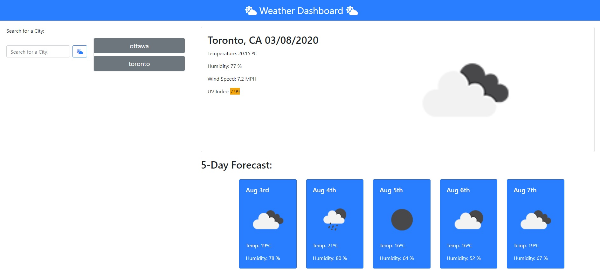

# homework6

In this task, we used the OpenWeather API to retrieve weather data for cities. 


## User Story

```
AS A traveler
I WANT to see the weather outlook for multiple cities
SO THAT I can plan a trip accordingly
```


## Solved Task Demo

So, our wheather dashbord will look like this:




The cool thing about this app is that it shows a 5-day forecast that displays the date, an icon representation of weather conditions, the temperature, and the humidity with a single click! Enjoy! ;) 


## Web Site Link

https://tarazin.github.io/weather-api/
